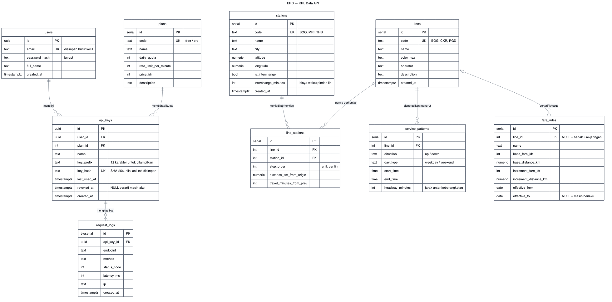
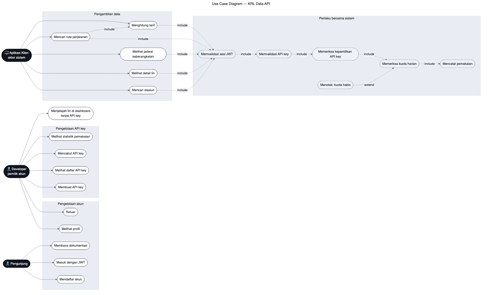
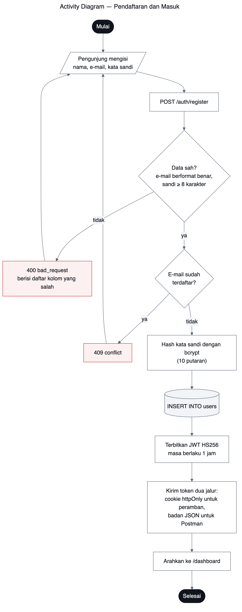
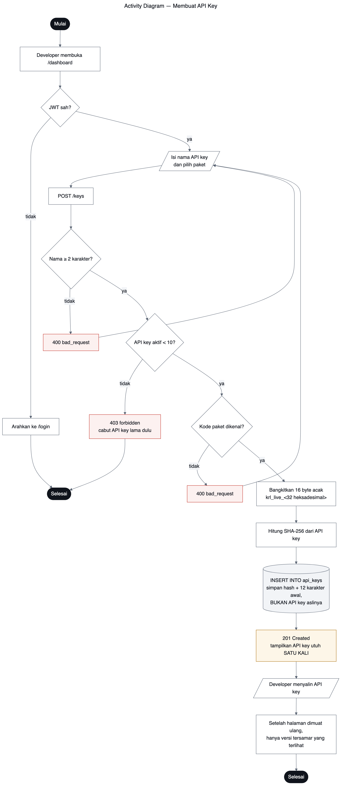
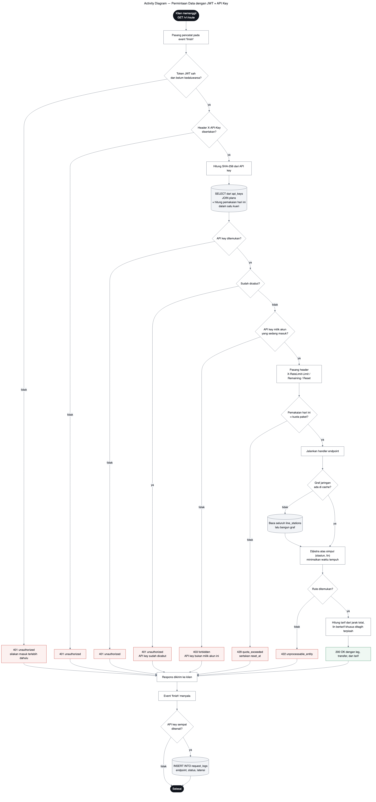

# KRL Data API
## Laporan Proyek — Software as a Service Penyedia Data Transportasi

**Mata kuliah:** Pemrograman Web Lanjut
**Nama:** _(isi nama)_
**NIM:** _(isi NIM)_
**Tanggal:** 24 Agustus 2026
**URL produksi:** _(isi setelah deploy, misalnya https://ta-pws.vercel.app)_
**Repositori:** _(isi URL repositori)_

---

## 1. Pendahuluan

### 1.1 Latar belakang

Data jaringan KRL Commuter Line Jabodetabek tersebar di banyak tempat dan tidak
tersedia dalam bentuk yang mudah dipakai program. Pengembang yang ingin membuat
aplikasi perjalanan harus mengumpulkan sendiri daftar stasiun, urutan
perhentian, jarak, dan aturan tarif — pekerjaan yang berulang dan mudah keliru.

Proyek ini membungkus data tersebut menjadi layanan berlangganan: pihak lain
mendaftar, memperoleh API key, lalu mengambil datanya lewat HTTP dengan
kuota harian yang tercatat. Polanya sama dengan OpenRouter atau layanan cuaca
berbayar yang menjadi contoh pada tugas.

### 1.2 Tujuan

1. Menyediakan data jaringan KRL dalam bentuk REST API yang terdokumentasi.
2. Menerapkan dua lapis autentikasi yang berbeda peruntukan — JWT membuktikan
   siapa pemanggilnya, API key menentukan kuota siapa yang terpakai — dan
   menuntut keduanya sekaligus pada setiap endpoint data.
3. Menegakkan kuota pemakaian per paket langganan dan mencatat setiap permintaan.
4. Menyediakan endpoint terhitung — pencarian rute dan perhitungan tarif — yang
   nilainya tidak sekadar menyalin isi tabel.

### 1.3 Batasan dan pernyataan sumber data

> **Data pada layanan ini adalah data referensi terkurasi untuk keperluan
> akademik.** Daftar stasiun, jarak antar stasiun, waktu tempuh, dan pola
> operasi disusun dari rujukan publik dan mendekati kondisi nyata, tetapi
> **bukan data operasional resmi KAI Commuter** dan tidak boleh dipakai untuk
> perencanaan perjalanan sungguhan.

Cakupan dibatasi pada enam lin: lima lin Commuter Line ditambah KA Bandara
Soekarno-Hatta. Jadwal disimpan sebagai pola operasi, bukan sebagai baris jam
keberangkatan satu per satu — alasannya dijelaskan di bagian 3.3.

---

## 2. Analisis Kebutuhan

### 2.1 Kebutuhan fungsional

| Kode | Kebutuhan | Aktor |
|------|-----------|-------|
| F-01 | Pengunjung dapat mendaftar akun dengan e-mail dan kata sandi | Pengunjung |
| F-02 | Pengunjung dapat masuk dan memperoleh token JWT | Pengunjung |
| F-03 | Developer dapat membuat API key dan memilih paket | Developer |
| F-04 | Developer dapat melihat daftar API key beserta pemakaiannya | Developer |
| F-05 | Developer dapat mencabut API key yang sudah tidak dipakai | Developer |
| F-06 | Developer dapat melihat statistik pemakaian tujuh hari terakhir | Developer |
| F-07 | Aplikasi klien dapat mencari stasiun menurut nama, lin, kota, atau kedekatan | Aplikasi klien |
| F-08 | Aplikasi klien dapat melihat detail lin beserta seluruh perhentiannya | Aplikasi klien |
| F-09 | Aplikasi klien dapat memperoleh jam keberangkatan dari sebuah stasiun | Aplikasi klien |
| F-10 | Aplikasi klien dapat mencari rute tercepat antar dua stasiun | Aplikasi klien |
| F-11 | Aplikasi klien dapat menghitung tarif antar dua stasiun | Aplikasi klien |
| F-12 | Sistem menolak permintaan data tanpa API key yang sah | Sistem |
| F-13 | Sistem menolak permintaan yang melampaui kuota harian | Sistem |
| F-14 | Sistem mencatat setiap permintaan beserta latensinya | Sistem |
| F-15 | Sistem menuntut sesi yang masuk (token JWT) pada seluruh endpoint data | Sistem |
| F-16 | Sistem menolak API key yang bukan milik akun yang sedang masuk | Sistem |
| F-17 | Developer dapat menjelajah isi data lin langsung dari dashboard | Developer |

### 2.2 Kebutuhan non-fungsional

| Kode | Kebutuhan |
|------|-----------|
| N-01 | Kata sandi disimpan sebagai hash bcrypt, tidak pernah dalam bentuk asli |
| N-02 | API key disimpan sebagai hash SHA-256; nilai aslinya hanya ditampilkan sekali |
| N-03 | Umur token JWT ditentukan `JWT_EXPIRES` (bawaan satu jam) dan dikirim lewat cookie httpOnly untuk peramban |
| N-04 | Aplikasi berjalan sebagai satu fungsi serverless di Vercel |
| N-05 | Basis data adalah PostgreSQL yang dilayani Supabase |
| N-06 | Setiap balasan galat memakai bentuk JSON yang seragam |
| N-07 | Kuota harian berganti pada tengah malam waktu Jakarta, bukan waktu server |
| N-08 | Tabel tidak boleh dapat dibaca langsung dari internet, melainkan hanya lewat endpoint yang disediakan |

---

## 3. Perancangan

### 3.1 Arsitektur

```
Peramban (dashboard) ──JWT lewat cookie httpOnly──────────┐
                                                          ├──► Aplikasi Express ──► PostgreSQL
Aplikasi klien       ──JWT: Authorization: Bearer ────────┘    satu fungsi           (Supabase,
(Postman, curl, dsb)   + API key: X-API-Key                    serverless             transaction
                                                               di Vercel              pooler)
```

Sistem memakai dua kredensial yang tugasnya berbeda, dan endpoint data menuntut
keduanya sekaligus:

| | Token JWT | API key |
|---|---|---|
| Dipakai oleh | manusia lewat peramban maupun program | program |
| Membuktikan | siapa pemanggilnya | kuota siapa yang terpakai |
| Umur | `JWT_EXPIRES` pada `.env`, bawaan satu jam | sampai dicabut |
| Untuk endpoint | `/auth/me`, `/keys/*`, halaman dashboard, **dan** `/v1/*` | `/v1/*` |
| Kena kuota | tidak | ya |
| Tercatat di log | tidak | ya |
| Cara dicabut | menunggu kedaluwarsa | dicabut kapan saja oleh pemiliknya |

Token berumur pendek karena manusia bisa masuk ulang dengan mudah. API key
berumur panjang karena program tidak bisa. Perbedaan itulah yang menuntut
mekanisme pencabutan pada key, dan yang membuat API key — bukan token — menjadi
satuan penagihan kuota.

Endpoint data menuntut dua-duanya karena keduanya menjawab pertanyaan yang
berlainan: token menjawab "siapa yang memanggil", API key menjawab "kuota siapa
yang dipotong". Sistem juga menolak kombinasi yang tidak konsisten — API key yang
dipakai harus milik akun yang tokennya sedang dipegang, kalau tidak balasannya
`403 forbidden`. Tanpa pemeriksaan itu, sebuah key yang bocor masih bisa dipakai
bersama sesi akun mana pun dan kuotanya terhitung ke pemilik yang keliru.

Pengelolaan API key sendiri (`/keys/*`) sengaja **tidak** menuntut API key. Kalau
ia menuntut, pengguna baru tidak akan pernah bisa membuat key pertamanya — untuk
meminta key ia harus sudah memegang key.

### 3.2 Entity Relationship Diagram



Basis data terdiri atas sembilan tabel yang terbagi dua kelompok.

**Kelompok SaaS** — `users`, `plans`, `api_keys`, `request_logs`. Seorang
pengguna memiliki banyak API key; setiap key terikat pada satu paket yang
menentukan kuotanya; setiap key menghasilkan banyak baris catatan permintaan.

**Kelompok domain** — `stations`, `lines`, `line_stations`, `service_patterns`,
`fare_rules`. Inti kelompok ini adalah `line_stations`, tabel penghubung
many-to-many antara lin dan stasiun. Sebuah stasiun dapat dilalui beberapa lin
(Manggarai dilalui tiga), dan sebuah lin melalui banyak stasiun.

Tiga kolom pada `line_stations` menanggung beban paling besar:

- `stop_order` menetapkan urutan perhentian, sehingga stasiun bersebelahan bisa
  ditemukan tanpa menghitung jarak geografis.
- `distance_km_from_origin` adalah jarak kumulatif; selisih dua barisnya
  memberi panjang satu ruas.
- `travel_minutes_from_prev` adalah bobot sisi pada graf pencarian rute.

Kolom terakhir tidak diisi manual melainkan diturunkan dari selisih jarak
memakai fungsi jendela `LAG()` saat penyemaian:

```sql
UPDATE line_stations ls
SET travel_minutes_from_prev = sub.mins
FROM (
  SELECT ls2.id,
         CASE WHEN ls2.stop_order = 1 THEN 0
              ELSE GREATEST(2, CEIL(
                (ls2.distance_km_from_origin
                 - LAG(ls2.distance_km_from_origin)
                     OVER (PARTITION BY ls2.line_id ORDER BY ls2.stop_order))
                / CASE WHEN l.code = 'BST' THEN 1.10 ELSE 0.62 END))
         END AS mins
  FROM line_stations ls2 JOIN lines l ON l.id = ls2.line_id
) AS sub
WHERE ls.id = sub.id;
```

Cara ini membuat data tetap konsisten: mengubah satu angka jarak otomatis
memperbaiki waktu tempuhnya, dan tidak mungkin ada baris yang jaraknya diperbarui
tetapi waktunya tertinggal.

### 3.3 Keputusan perancangan yang perlu dijelaskan

**Jadwal disimpan sebagai pola, bukan sebagai baris keberangkatan.**
Jadwal KRL sesungguhnya berjumlah puluhan ribu baris. Menyimpan semuanya
membebani basis data tanpa menambah kekayaan relasi yang justru menjadi pokok
penilaian. Sebagai gantinya, `service_patterns` menyimpan rentang jam beserta
headway-nya — misalnya "hari kerja, arah up, 06:00–09:00, tiap 6 menit" — dan
jam keberangkatan dibangkitkan saat permintaan datang. Dua belas baris pola
menggantikan ribuan baris jadwal, dan mengubah frekuensi layanan cukup dengan
mengubah satu angka.

**Aturan tarif disimpan sebagai data, bukan sebagai angka di dalam kode.**
Tabel `fare_rules` menyimpan tarif dasar, jarak dasar, dan tambahan per satuan
jarak. Kolom `effective_from` dan `effective_to` memungkinkan tarif lama
disimpan sebagai riwayat, sehingga perubahan tarif cukup dilakukan dengan
menambah satu baris. Kolom `line_id` yang boleh kosong menangani kasus lin yang
bertarif sendiri: KA Bandara memakai tarif tetap Rp70.000, sedangkan seluruh
lin Commuter Line berbagi satu aturan progresif.

**Simpul graf adalah pasangan (stasiun, lin), bukan stasiun saja.**
Ini keputusan paling menentukan pada mesin pencari rute, dijelaskan di bagian
3.5.

### 3.4 Use Case Diagram



Terdapat tiga aktor. **Pengunjung** belum punya akun dan hanya dapat mendaftar,
masuk, serta membaca dokumentasi. **Developer** adalah pengunjung yang sudah
masuk; ia mengelola akun dan API key miliknya. **Aplikasi klien** adalah aktor
sistem — program yang memegang API key dan mengambil data.

Perlu diperhatikan bahwa aktor yang mengambil data bukanlah developer, melainkan
program yang ia bangun. Pemisahan ini mencerminkan keadaan sebenarnya: developer
mengelola kredensial, program memakainya.

Empat use case dikelompokkan sebagai perilaku bersama:

- **Memvalidasi API key** di-*include* oleh setiap use case pengambilan data.
- **Memeriksa kuota harian** di-*include* oleh validasi API key.
- **Mencatat pemakaian** di-*include* oleh pemeriksaan kuota.
- **Menolak: kuota habis** meng-*extend* pemeriksaan kuota, karena hanya
  terjadi pada kondisi tertentu.

Selain itu, **Mencari rute perjalanan** meng-*include* **Menghitung tarif**:
jawaban rute selalu menyertakan tarifnya, jadi keduanya tidak berdiri sendiri.

### 3.5 Activity Diagram

#### 3.5.1 Pendaftaran dan masuk



Yang perlu diperhatikan pada alur ini adalah penerbitan token melalui dua jalur
sekaligus. Cookie `httpOnly` melayani dashboard di peramban dan tidak dapat
dibaca JavaScript, sehingga aman dari pencurian lewat XSS. Namun klien seperti
Postman tidak mengenal cookie, jadi token yang sama juga dikembalikan di badan
respons.

Satu hal lain: kesalahan kata sandi dan e-mail yang tidak terdaftar dijawab
dengan pesan yang persis sama. Pesan yang berbeda akan membuat penyerang bisa
menebak alamat e-mail mana yang terdaftar hanya dengan mencoba masuk.

#### 3.5.2 Membuat API key



Simpul yang disorot pada diagram adalah penampilan API key. Sistem membangkitkan
16 byte acak, menyimpan **hash SHA-256**-nya beserta dua belas karakter awal,
lalu mengembalikan nilai utuhnya satu kali saja. Sesudah itu nilai asli tidak
dapat dipulihkan oleh siapa pun, termasuk oleh sistem ini sendiri, sehingga
bocornya isi tabel `api_keys` tidak dengan sendirinya membocorkan key yang
masih berlaku.

Dipakai SHA-256, bukan bcrypt seperti pada kata sandi, karena API key harus
diverifikasi pada setiap permintaan. Bcrypt sengaja dibuat lambat dan akan
menjadi beban di jalur terpanas ini. Perlambatan itu berguna untuk kata sandi
buatan manusia yang bisa ditebak, tetapi tidak diperlukan untuk key berisi 128
bit acak.

#### 3.5.3 Permintaan data dengan JWT dan API key



Inilah alur yang paling sering dijalankan sistem. Seluruh pemeriksaannya dipasang
terpusat satu kali di `src/routes/v1/index.js`, bukan diulang di tiap berkas
route, sehingga berlaku untuk keenam sub-router `/v1` sekaligus:

```js
router.use(logApiRequest, requireJwt, requireApiKey, requireApiKeyOwner, enforceQuota);
```

Empat hal patut dicatat.

**Pencatat dipasang paling awal.** Middleware pencatat hanya menitipkan
pendengar pada event `finish`; isi catatannya baru dibaca setelah respons
terkirim. Dengan urutan ini, permintaan yang ditolak karena kuota habis pun
tetap tercatat — padahal ia tidak pernah sampai ke handler endpoint.

**Gerbang JWT mendahului pemeriksaan API key.** Urutannya dipilih supaya
pengunjung yang belum masuk memperoleh jawaban tentang sesinya ("Silakan masuk
terlebih dahulu."), bukan jawaban tentang API key yang belum tentu ia punya.
Konsekuensinya diterima secara sadar: permintaan yang tertahan di gerbang JWT
belum sempat mengenali API key mana pun, sehingga ia tidak tercatat di
`request_logs` — itulah sebabnya alur pencatatan di ujung diagram masih memakai
percabangan "API key sempat dikenali?". Penolakan karena kuota habis tetap
tercatat seperti sebelumnya, karena pada titik itu key-nya sudah dikenali.

**Validasi API key dan hitungan kuota terjadi dalam satu kueri.** Menyatukan
pencarian key, pengambilan kuota paket, dan penghitungan pemakaian hari ini
menghemat dua kali bolak-balik jaringan pada setiap permintaan — penghematan
yang terasa besar di lingkungan serverless, tempat setiap koneksi berumur pendek.

**Pencatatan tidak menghambat respons.** Penulisan ke `request_logs` terjadi
setelah respons terkirim, dan kegagalannya hanya dilaporkan ke konsol.
Permintaan yang sudah berhasil dilayani tidak pantas dianggap gagal hanya karena
pencatatan bermasalah.

**Kepemilikan key diperiksa terpisah dari keabsahannya.** `requireApiKey` hanya
menjawab "key ini sah dan belum dicabut", sedangkan `requireApiKeyOwner` menjawab
"key ini milik akun yang sedang masuk". Dipisah menjadi dua middleware supaya
pemeriksaan keabsahan tetap bisa dipakai sendirian bila kelak dibutuhkan, dan
supaya kedua penolakan bisa dibedakan pemanggil: `401` untuk kredensial yang
tidak sah, `403` untuk kredensial sah yang tidak berhak.

---

## 4. Implementasi

### 4.1 Teknologi

| Lapis | Teknologi |
|-------|-----------|
| Runtime | Node.js 20+ |
| Kerangka kerja web | Express 5 |
| Basis data | PostgreSQL 15+ (Supabase) |
| Akses basis data | `pg` dengan SQL berparameter, tanpa ORM |
| Autentikasi | `jsonwebtoken` (HS256), `bcryptjs` |
| Templat halaman | EJS |
| Pengujian | `node:test` dan `supertest` |
| Deployment | Vercel (satu fungsi serverless) |

SQL ditulis langsung tanpa ORM agar kueri yang menjadi inti proyek — agregasi,
`LATERAL JOIN`, fungsi jendela, dan haversine — terlihat apa adanya dan dapat
dinilai.

### 4.2 Struktur berkas

Aplikasi disusun mengikuti pola **Model-View-Controller**, dengan satu lapisan
tambahan berisi logika domain murni.

```
ta-pws/
├── api/index.js              titik masuk Vercel
├── src/
│   ├── app.js                penyusunan Express
│   ├── errors.js             kelas ApiError
│   ├── config/
│   │   ├── index.js          pembacaan dan validasi environment variable
│   │   ├── database.js       kolam koneksi Postgres
│   │   └── time.js           batas hari waktu Jakarta untuk kuota
│   ├── models/               network.js, users.js, apiKeys.js, logs.js
│   ├── views/                home, login, register, dashboard, docs, error
│   │   └── partials/         head, header, footer, endpoint
│   ├── controllers/          station, line, schedule, route, fare, stats,
│   │                         auth, key, dashboard
│   ├── routes/               pemetaan path menuju controller
│   │   ├── auth.js  keys.js  dashboard.js
│   │   └── v1/               stations, lines, schedules, route, fare, stats
│   ├── middleware/           jwtAuth, apiKeyAuth, quota, requestLogger, errorHandler
│   ├── docs/                 isi halaman dokumentasi (apiReference.js)
│   └── services/             graph, routeEngine, fareCalculator,
│                             scheduleGenerator, apiKey, auth, networkCache
├── db/schema.sql             DDL sembilan tabel
├── db/seed.sql               data awal
├── scripts/db.sh             pengelola Postgres lokal
├── tests/                    76 kasus uji
└── docs/                     laporan dan diagram
```

Pembagian perannya:

| Lapisan | Isi | Tanggung jawab |
|---------|-----|----------------|
| **Model** | `src/models/` | seluruh akses basis data, satu berkas per domain |
| **View** | `src/views/` | templat EJS yang dirender ke peramban |
| **Controller** | `src/controllers/` | membaca permintaan, memanggil model dan service, menyusun respons |
| Route | `src/routes/` | hanya memetakan path ke controller, tanpa logika |
| Middleware | `src/middleware/` | autentikasi, kuota, pencatatan, penanganan galat |
| Service | `src/services/` | logika domain murni |

Pemisahan `routes/` dari `controllers/` membuat berkas route sangat tipis —
seluruhnya hanya 147 baris untuk sepuluh berkas — sehingga daftar endpoint dapat
dibaca sekilas tanpa terhalang isi handler-nya.

Berkas di dalam `services/` sengaja berisi fungsi murni: tidak menyentuh basis
data, tidak membaca waktu, dan selalu memberi hasil sama untuk masukan sama.
Karena itu bagian yang paling rumit justru yang paling mudah diuji. Satu-satunya
pengecualian adalah `networkCache.js`, yang memang bertugas memuat graf jaringan
dari model.

### 4.3 Mesin pencari rute

Rute dicari dengan algoritma **Dijkstra**, dengan satu keputusan yang menentukan
benar tidaknya hasil: **simpul graf bukan stasiun, melainkan pasangan (stasiun,
lin).**

Manggarai dilalui tiga lin. Bila Manggarai dijadikan satu simpul, algoritma akan
menganggap berpindah dari Lin Bogor ke Lin Cikarang tidak memakan waktu sama
sekali, dan akan menyarankan rute penuh transfer yang terlihat cepat di atas
kertas tetapi melelahkan di dunia nyata. Dengan simpul berpasangan, ada dua
jenis sisi:

| Jenis sisi | Menghubungkan | Bobot | Menambah jarak |
|---|---|---|---|
| `ride` | perhentian berurutan pada lin yang sama | waktu tempuh ruas | ya |
| `transfer` | lin berbeda di stasiun yang sama | `interchange_minutes` | tidak |

Yang diminimalkan adalah **waktu**, bukan jarak. Akibatnya rute yang memutar
lebih jauh dapat terpilih bila lin yang dilaluinya lebih cepat — perilaku yang
diuji secara khusus pada `tests/routeEngine.test.js`.

Titik awal pencarian bukan satu simpul melainkan semua simpul di stasiun asal,
masing-masing berbiaya nol, karena penumpang bebas memulai dari peron lin mana
pun.

### 4.4 Perhitungan tarif

Tarif dihitung dari **jarak total perjalanan**, bukan dijumlahkan per leg, sesuai
cara KRL menagih: sekali tap masuk, sekali tap keluar. Perjalanan 20 km disambung
20 km dikenai tarif untuk 40 km (Rp5.000), bukan dua kali tarif dasar (Rp6.000).

Lin yang punya aturan tarif sendiri ditagih terpisah, karena penumpangnya memang
membeli tiket sendiri. Perjalanan Bogor → Bandara Soekarno-Hatta menghasilkan:

```
Rp 5.000   Tarif Commuter Line          BOG   41,8 km
Rp70.000   Tarif KA Bandara Soekarno-Hatta  BST   36,3 km
─────────
Rp75.000   total
```

Seluruh jarak diubah lebih dulu menjadi bilangan bulat satuan sepuluh meter
sebelum dibandingkan dengan batas tarif. Tanpa itu, 35 km bisa terbaca sebagai
35,000000000000004 km karena galat bilangan pecahan biner, dan penumpang ditagih
satu tingkat lebih mahal daripada seharusnya.

### 4.5 Menutup pintu belakang basis data

Supabase menyajikan setiap tabel di skema `public` lewat PostgREST, dan
*anon key* proyek bersifat publik — memang dirancang untuk ditanam di kode
aplikasi peramban. Akibatnya, tanpa penanganan khusus, siapa pun yang memegang
key publik itu dapat membaca tabel langsung dari internet:

```
GET https://<ref>.supabase.co/rest/v1/users?select=*
```

Permintaan semacam itu melewati seluruh pemeriksaan yang dikerjakan aplikasi —
API key, kuota, dan pencatatan tidak berlaku sama sekali — dan yang terbuka
bukan hanya data KRL, melainkan juga tabel `users` dan `api_keys`. Seluruh
rancangan keamanan pada bagian sebelumnya menjadi tidak ada artinya bila jalur
ini dibiarkan.

Penutupnya adalah menyalakan **Row Level Security tanpa satu pun policy**:

```sql
ALTER TABLE users    ENABLE ROW LEVEL SECURITY;
ALTER TABLE api_keys ENABLE ROW LEVEL SECURITY;
-- dan seterusnya untuk kesembilan tabel
```

Tanpa policy, peran `anon` dan `authenticated` tidak memperoleh baris apa pun.
Aplikasi tetap berjalan normal karena ia terhubung langsung ke Postgres sebagai
pemilik tabel, dan pemilik tabel melewati RLS. Hasilnya, satu-satunya jalan
menuju data adalah endpoint yang memang disediakan.

Pemeriksaan setelah perubahan diterapkan:

```
GET /rest/v1/users?select=*&limit=1     -> []
GET /rest/v1/api_keys?select=*&limit=1  -> []
GET /rest/v1/stations?select=*&limit=1  -> []      (padahal berisi 74 baris)
```

Alat pemeriksa keamanan bawaan Supabase yang semula melaporkan sembilan
kesalahan tingkat *ERROR* kini tidak melaporkan satu pun.

### 4.6 Penegakan kuota

Kuota harian berganti pada **tengah malam waktu Jakarta**. Ini bukan detail
sepele: Vercel dan Supabase sama-sama berjalan dengan zona UTC, sehingga tanpa
penyesuaian kuota pengguna akan disetel ulang pukul tujuh pagi WIB — tepat di
tengah jam sibuk. Batas hari yang sama dipakai di dua tempat, yaitu pada
penghitungan di SQL dan pada nilai `reset_at` yang dikirim ke klien:

```sql
(date_trunc('day', now() AT TIME ZONE 'Asia/Jakarta') AT TIME ZONE 'Asia/Jakarta')
```

Setiap balasan membawa header `X-RateLimit-Limit`, `X-RateLimit-Remaining`, dan
`X-RateLimit-Reset`, sehingga klien tahu sisa jatahnya tanpa perlu menebak.

---

## 5. Pengujian

Seluruh pengujian dijalankan dengan `npm test`.

| Berkas | Fokus | Kasus |
|--------|-------|-------|
| `fareCalculator.test.js` | perhitungan tarif, termasuk perilaku tepat di batas jarak | 11 |
| `scheduleGenerator.test.js` | pembangkitan jam keberangkatan dari pola | 10 |
| `routeEngine.test.js` | graf jaringan dan Dijkstra, dengan jaringan fixture | 10 |
| `auth.test.js` | pendaftaran, masuk, dan penanganan token | 9 |
| `apiKeys.test.js` | daur hidup API key, pencabutan, kuota, pencatatan | 10 |
| `dataEndpoints.test.js` | seluruh endpoint `/v1` dari ujung ke ujung, termasuk gerbang autentikasinya | 26 |
| **Total** | | **76** |

Tiga pengujian yang paling menjelaskan rancangan:

**Nilai API key tidak pernah muncul dua kali.** Setelah key dibuat, seluruh isi
balasan `GET /keys` diperiksa untuk memastikan nilai utuhnya tidak ada di
dalamnya, dan isi kolom `key_hash` diperiksa untuk memastikan yang tersimpan
memang hash sepanjang 64 heksadesimal.

**Permintaan yang gagal tetap tercatat.** Dua permintaan dikirim — satu berhasil
dan satu menghasilkan 404 — lalu tabel `request_logs` diperiksa untuk memastikan
keduanya masuk dengan kode status yang benar.

**Tarif dihitung dari jarak total.** Rute Bogor → Tanah Abang melewati dua lin;
pengujian memastikan tarifnya sama dengan tarif untuk jarak gabungan, bukan
jumlah tarif tiap leg.

Batas kuota diuji dengan menyisipkan paket khusus berkuota dua baris lewat SQL,
sehingga penolakan 429 dapat dibuktikan tanpa perlu mengirim seribu permintaan.

---

## 6. Deployment

Aplikasi berjalan sebagai **satu fungsi serverless** di Vercel. Berkas
`api/index.js` mengekspor aplikasi Express, dan seluruh permintaan diarahkan ke
sana lewat `vercel.json`:

```json
{
  "functions": { "api/index.js": { "includeFiles": "src/views/**" } },
  "rewrites": [{ "source": "/(.*)", "destination": "/api" }]
}
```

Baris `includeFiles` wajib ada. Berkas templat EJS tidak ikut terbawa secara
otomatis ke dalam bundel fungsi, dan tanpa baris itu dashboard akan menjawab 500
di produksi meskipun berjalan normal di komputer sendiri.

Koneksi ke Supabase memakai **transaction pooler pada porta 6543**, bukan
koneksi langsung pada porta 5432, dengan `max: 1` pada kolam koneksi. Setiap
pemanggilan fungsi serverless membuka koneksinya sendiri; koneksi langsung akan
menghabiskan jatah koneksi Supabase begitu lalu lintas naik.

Environment variable yang harus diisi di Vercel:

| Nama | Isi |
|------|-----|
| `DATABASE_URL` | connection string transaction pooler Supabase |
| `JWT_SECRET` | string acak minimal 32 karakter (`openssl rand -hex 32`) |
| `JWT_EXPIRES` | umur token dalam detik; opsional, bawaan `3600` |
| `NODE_ENV` | `production` |
| `APP_URL` | URL produksi, dipakai pada contoh di halaman dokumentasi |

---

## 7. Hasil

### 7.1 Isi basis data

| Tabel | Baris |
|-------|------:|
| `stations` | 74 |
| `lines` | 6 |
| `line_stations` | 82 |
| `service_patterns` | 120 |
| `fare_rules` | 3 |
| `plans` | 2 |
| **Total data awal** | **287** |

Syarat minimal lima puluh baris terlampaui hampir enam kali lipat.

### 7.2 Contoh keluaran

`POST /v1/route` dengan `{"from":"BOO","to":"THB"}`:

```
Bogor -> Tanah Abang
total: 91 menit, 46.9 km, transfer: 1 (6 menit)
  BOG  BOO -> MRI  | 16 perhentian, 76 menit, 41.8 km
  CKR  MRI -> THB  |  3 perhentian,  9 menit,  5.1 km
tarif: Rp6.000
  Tarif Commuter Line | Rp3.000 untuk 25 km pertama
                      + Rp3.000 untuk sisa 21.90 km (3 x 10 km)
```

### 7.3 Ringkasan jaringan

74 stasiun, 6 lin, 6 stasiun transit, 82 perhentian, tersebar di 14 kota dan
kabupaten, dengan total panjang jalur 234,6 km.

### 7.4 Antarmuka yang dihasilkan

Selain REST API, sistem menghasilkan dua antarmuka yang keduanya dirender di
sisi server dari sumber data yang sama dengan API-nya.

**Halaman dokumentasi `/docs`.** Terbuka untuk umum dan berdiri sendiri: peta
akses yang membedakan rute publik, rute berpagar JWT, dan rute yang menuntut JWT
sekaligus API key; langkah pemakaian dari nol; serta referensi sembilan belas
endpoint yang masing-masing memuat tabel parameter, contoh `curl`, dan contoh
balasan. Isinya berasal dari `src/docs/apiReference.js`, sebuah modul data murni
tanpa akses basis data — dipisahkan dari controller dengan alasan yang sama
seperti `src/services/`: bagian yang panjang dan sering disunting lebih mudah
diperiksa bila ia tidak bisa menimbulkan efek samping. Angka kuota pada halaman
itu dibaca dari tabel `plans`, bukan ditulis tetap, sehingga tidak bisa menyimpang
dari kuota yang sesungguhnya ditegakkan.

**Penjelajah lin pada dashboard.** Enam chip berwarna sesuai identitas tiap lin;
memilih satu menampilkan ringkasannya, diagram urutan stasiun, dan blok JSON.
Tujuannya adalah verifikasi: JSON yang ditampilkan dicetak dari objek `listLines()`
yang persis sama dengan yang dibalas `GET /v1/lines`, sehingga hasil di Postman
dapat dicocokkan baris per baris dengan tampilan di dashboard, bukan dikira-kira.

Bagian kedua ini juga menunjukkan satu konsekuensi rancangan yang tidak langsung
terlihat. Setelah endpoint data menuntut API key, halaman dashboard **tidak bisa**
memanggil `/v1/lines` dari peramban: nilai utuh API key hanya ditampilkan sekali
saat dibuat dan sesudahnya basis data hanya memegang hash-nya, sehingga peramban
tidak punya apa pun untuk dikirim pada header `X-API-Key`. Karena itu datanya
dirender bersama halaman, dan pergantian lin tidak memerlukan permintaan jaringan
sama sekali. Aturan keamanan yang dipilih di satu tempat ternyata menentukan cara
antarmuka di tempat lain harus dibangun.

---

## 8. Penutup

### 8.1 Kesimpulan

Seluruh kebutuhan yang ditetapkan pada bagian 2 telah terpenuhi. Sistem
menyediakan sembilan tabel dengan relasi many-to-many, penerapan JWT dan API
API yang terpisah peruntukannya, penegakan kuota berbasis paket, pencatatan
pemakaian, serta dua endpoint terhitung yang nilainya melampaui sekadar
membacakan isi tabel.

Bagian yang paling menuntut ketelitian bukan autentikasinya, melainkan
pemodelan graf jaringan. Keputusan menjadikan pasangan (stasiun, lin) sebagai
simpul adalah pembeda antara hasil yang benar dan hasil yang sekadar tampak
benar.

### 8.2 Keterbatasan

1. Data adalah referensi terkurasi, bukan data operasional resmi. Jarak dan
   waktu tempuh merupakan perkiraan.
2. Jadwal berupa pola headway, sehingga tidak mencerminkan keberangkatan
   sesungguhnya pada menit tertentu.
3. Rute dicari berdasarkan waktu tempuh statis; kepadatan penumpang dan
   keterlambatan tidak diperhitungkan.
4. Kuota ditegakkan per hari; pembatasan per menit sudah tersimpan di tabel
   `plans` tetapi belum diterapkan.

### 8.3 Pengembangan lanjutan

Menambahkan moda lain (MRT, LRT, TransJakarta) hanya memerlukan penambahan baris
pada `lines` dan `line_stations` — mesin rute tidak perlu diubah sama sekali,
karena ia bekerja pada graf, bukan pada asumsi tentang KRL. Penerapan pembatasan
per menit dan pembayaran paket Pro adalah langkah berikutnya yang paling
langsung.

---

## Lampiran A — Daftar endpoint

### Memerlukan token JWT **dan** API key (`Authorization: Bearer` + `X-API-Key`)

API key yang disertakan harus milik akun yang tokennya sedang dipakai; bila tidak,
balasannya `403 forbidden`.

| Metode | Path | Keterangan |
|--------|------|------------|
| GET | `/v1/stations` | Daftar stasiun; saring dengan `search`, `line`, `city`, atau `near=lintang,bujur` |
| GET | `/v1/stations/:code` | Detail stasiun, lin yang melayaninya, dan stasiun tetangganya |
| GET | `/v1/lines` | Daftar lin beserta jumlah stasiun dan panjang jalur |
| GET | `/v1/lines/:code` | Detail lin dengan seluruh perhentian berurutan |
| GET | `/v1/schedules` | Jam keberangkatan; wajib `station` |
| POST | `/v1/route` | Rute tercepat antar stasiun beserta transfer dan tarif |
| GET | `/v1/route` | Sama seperti di atas, parameternya lewat query string |
| GET | `/v1/fare` | Tarif antar dua stasiun |
| GET | `/v1/stats` | Ringkasan jaringan |

### Memerlukan token JWT saja

Sengaja tanpa API key: di sinilah API key pertama dibuat.

| Metode | Path | Keterangan |
|--------|------|------------|
| GET | `/auth/me` | Profil akun |
| GET | `/keys` | Daftar API key beserta pemakaiannya |
| POST | `/keys` | Buat API key baru |
| GET | `/keys/plans` | Daftar paket yang bisa dipilih |
| GET | `/keys/usage` | Pemakaian harian seluruh key milik akun; `days` 1-30 |
| GET | `/keys/:id/usage` | Riwayat lima puluh permintaan terakhir |
| DELETE | `/keys/:id` | Cabut API key |
| GET | `/dashboard` | Halaman dashboard; pengunjung anonim diarahkan ke `/login` |

### Terbuka

| Metode | Path | Keterangan |
|--------|------|------------|
| POST | `/auth/register` | Buat akun; balasannya sudah memuat token |
| POST | `/auth/login` | Masuk dan ambil token baru |
| POST | `/auth/logout` | Akhiri sesi dan hapus cookie |
| GET | `/health` | Pemeriksaan kesehatan layanan |
| GET | `/` | Beranda |
| GET | `/docs` | Dokumentasi API |
| GET | `/login`, `/register` | Halaman masuk dan pendaftaran |

## Lampiran B — Kode error

| HTTP | `code` | Penyebab |
|------|--------|----------|
| 400 | `bad_request` | Parameter kurang atau formatnya salah |
| 401 | `unauthorized` | Token atau API key tidak ada, salah, kedaluwarsa, atau sudah dicabut |
| 403 | `forbidden` | API key bukan milik akun yang sedang masuk, atau melampaui batas sepuluh API key aktif |
| 404 | `not_found` | Kode stasiun, lin, atau API key tidak ditemukan |
| 409 | `conflict` | E-mail sudah terdaftar |
| 422 | `unprocessable_entity` | Dua stasiun tidak terhubung dalam jaringan |
| 429 | `quota_exceeded` | Kuota harian habis |

## Lampiran C — Cara menjalankan

```bash
npm install
cp .env.example .env        # isi DATABASE_URL dan JWT_SECRET; JWT_EXPIRES opsional
npm run migrate             # buat tabel dan isi data awal
npm test                    # 76 pengujian
npm run dev                 # http://localhost:3000
npm run docs                # render ulang diagram menjadi PNG
```
